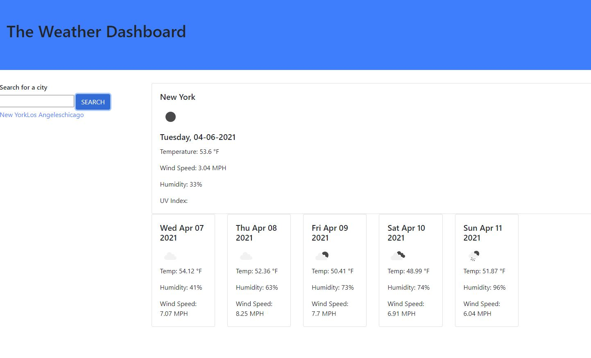

# Weather-Dashboard

# Table of Contents

1. [Description](#Description)
2. [Application Preview](#Application-Preview)
3. [Application Link](#Application-Link)
4. [License](#License)
5. [Badges](#Badges)
6. [Contact](#Contact)

# Description

This application is a Weather Dashboard that will display current and future weather with visual icons. In the dashboard it displays the current date, temperature, wind speed, and the humidity levels. The dashboard also displays a 5 day forecast for the current city that renders the weather icon, temperature, humidity, wind speed. This application is utilizing local storage and will store the inputs of the past city searched.

This application is utilizing the https://openweathermap.org/ API, HTML, CSS, JavaScript, and Jquery.

# Application Preview

Here is a preview of my web application:  

# Application Link

https://japluas93.github.io/Weather-Dashboard/

# License

[MIT](https://choosealicense.com/licenses/mit/)

[OpenWeather API](https://openweathermap.org/api)

# Badges

# Contact

If you have any additional questions, feel free to reach me at:  
[Github Profile](https://github.com/Japluas93)  
Email: [julianpluas@gmail.com]()
